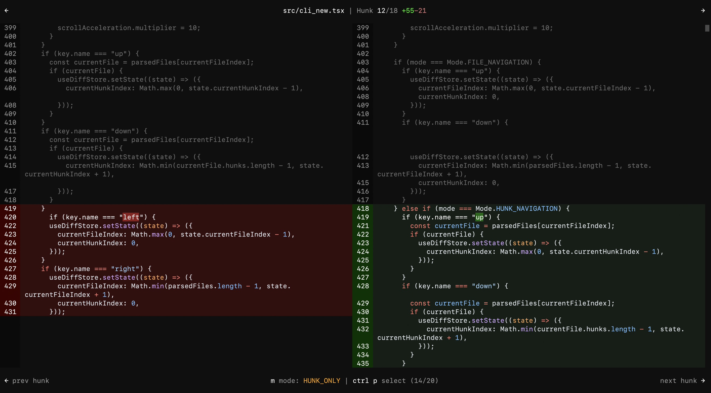

# Tracer

Terminal UI to speed up code reviews & debugging.



## What it does

Syntax-highlighted diff viewer with multiple navigation modes and optional AI classification of changes. Navigate by file, by hunk, or let AI sort changes by importance (breaking changes first, then features, fixes, etc).

**Intelligent mode is optimized for large PRs/diffs** where semantic ordering and automatic prioritization save significant review time. For small changes (a few files), manual review is typically faster than waiting for AI analysis. The real value emerges in these scenerios:
- Large PRs with dozens of files
- Unfamiliar codebases where you need context quickly
- Complex refactors where understanding the critical path matters
- Small teams with very fast changing codebases
- Diffs where LLM-generated code needs efficient human verification

## Installation

```bash
# Quick use (no installation)
bunx @cs50victor/tracer

# Install or update
bun install -g @cs50victor/tracer
```

## Usage

```bash
# View unstaged changes
tracer

# View staged changes
tracer --staged

# View specific commit
tracer --commit HEAD~1

# View git ref
tracer main..feature-branch

# AI-powered analysis (press 'm' to cycle to INTELLIGENT mode)
tracer --model claude   # or --model codex

# Pick files from another branch
tracer pick feature-branch

# Git difftool integration
git config --global diff.tool tracer
git config --global difftool.tracer.cmd 'tracer difftool "$LOCAL" "$REMOTE"'
git difftool
```

## Navigation

- `m` - Cycle modes (FILE / HUNK / HUNK_ONLY / INTELLIGENT)
- `ctrl+p` - Quick file search
- Arrow keys - Navigate (behavior changes per mode)
- `q` or `esc` - Quit

---
> [!IMPORTANT]
> This tool is in active exploration of how AI can reduce PR review time. Design ideas and implementation feedback are welcome.

Scaffolded from [critique](https://github.com/remorses/critique).
