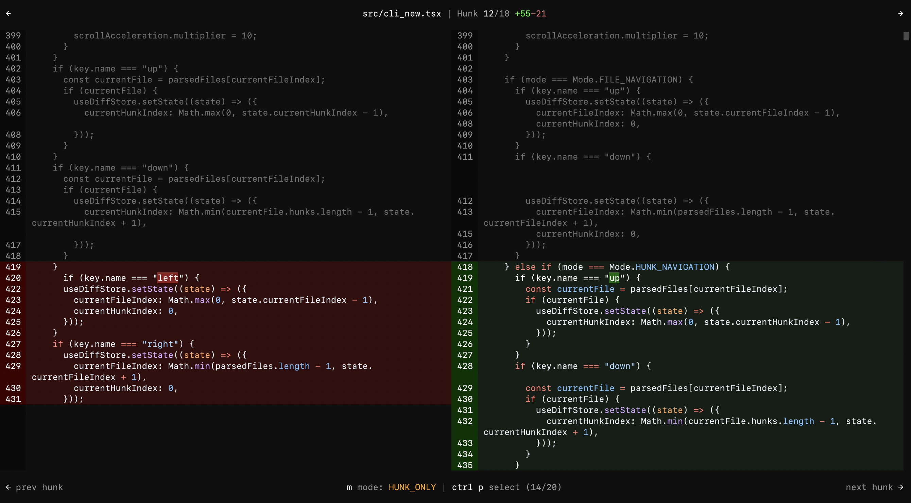

# Tracer

Terminal UI to speed up code reviews & debugging.



## What it does

Syntax-highlighted diff viewer with multiple navigation modes and optional AI classification of changes. Navigate by file, by hunk, or let AI sort changes by importance (breaking changes first, then features, fixes, etc).

**Intelligent mode is optimized for large PRs/diffs** where semantic ordering and automatic prioritization save significant review time. For small changes (a few files), manual review is typically faster than waiting for AI analysis. The real value emerges in these scenerios:
- Large PRs with dozens of files
- Unfamiliar codebases where you need context quickly
- Complex refactors where understanding the critical path matters
- Small teams with very fast changing codebases
- Diffs where LLM-generated code needs efficient human verification

## Installation

```bash
# Quick use (no installation)
bunx @cs50victor/tracer

# Install or update with Bun
bun install -g @cs50victor/tracer

# Install with Homebrew
brew tap cs50victor/tap
brew install tracer

# Zed opens MCP code previews by default
brew install --cask zed

# Optional: Ghostty for highlighted terminal previews
brew install --cask ghostty
```

## Usage

```bash
# View unstaged changes
tracer

# View staged changes
tracer --staged

# View specific commit
tracer --commit HEAD~1

# View git ref
tracer main..feature-branch

# AI-powered analysis (press 'm' to cycle to INTELLIGENT mode)
tracer --model claude   # or --model codex

# Pick files from another branch
tracer pick feature-branch

# Git difftool integration
git config --global diff.tool tracer
git config --global difftool.tracer.cmd 'tracer difftool "$LOCAL" "$REMOTE"'
git difftool
```

## MCP server

`tracer mcp` starts a stdio MCP server for agent-guided code walkthroughs. Add it to an MCP client with:

```json
{
  "mcpServers": {
    "tracer": {
      "command": "tracer",
      "args": ["mcp"]
    }
  }
}
```

The server exposes five tools:

- `setup` returns a model prompt for a checklist-driven walkthrough based on Matt Pocock's `teach` skill, with non-media scope, code regions of at most 50 lines, retrieval checks, and learner confirmation before continuing. It does not mutate files.
- `highlight_code_region` opens a local file or the latest GitHub pull request diff in Zed by default. With line bounds, it opens a snapshot comparison that highlights the requested range as additions. Set `diff: false` to open the source file normally, or `editor: "ghostty"` for a terminal preview rendered and highlighted by `bat`; `gh` fetches each PR diff when requested. Tracer assigns each server process a viewer ID; competing views return a structured `VIEW_CONFLICT` with the current session and lease expiry.
- `initialize_directory_checklist` writes the Git-respected file list to `.tracer/walkthrough.json` in the selected directory.
- `mark_file_explained` atomically records that a file has been explained.
- `list_directory_checklist` returns open, done, or all files with pagination and aggregate counts.

Completion records are separate, exclusive-create JSON markers under `.tracer/explained/`. Multiple agents and multiple MCP server processes can safely use the same checklist at once.

Tool failures use structured JSON with `code`, `message`, and raw command details such as `stderr` and `exit_code` when available.

For example, call `highlight_code_region` with:

```json
{
  "target": "local",
  "editor": "zed",
  "diff": true,
  "path": "/absolute/path/to/file.ts",
  "start_line": 20,
  "end_line": 40
}
```

`editor` defaults to `"zed"` and `diff` defaults to `true`. With both line bounds, Tracer creates two temporary snapshots: an unchanged copy and a baseline with the inclusive range removed. Zed opens them with `--add --diff`, jumps to `start_line`, and colors the range as additions. The source stays untouched, and the unchanged snapshot preserves its line numbers. This is a generated comparison, not actual Git changes or a text selection; repeated identical lines can shift diff alignment.

Set `"diff": false` to open the source directly with `zed --add path:start_line`, reusing an existing tab for the same file. Without line bounds, Zed opens the source at line 1 regardless of `diff`. Both bounds must be supplied together; snapshot comparisons reject ranges beyond the file's content lines. A trailing newline does not add an extra content line.

`diff` applies only to Zed. With `"editor": "ghostty"`, `bat` highlights the inclusive range and shows surrounding `context_lines`. Zed always shows the full snapshot and ignores `context_lines`. For PR previews, line numbers refer to the fetched `.diff` file.

Results report the applied `diff` mode and, for Zed comparisons, `preview_path` and `baseline_path`. Snapshots are stored under `~/.tracer/previews` and pruned after 24 hours when another preview is requested. Failed launches remove their snapshots.

The `zed` CLI must be on PATH. The Homebrew formula installs `bat` and `gh`; Zed and optional Ghostty are separate casks. Zed previews do not require `bat` or Ghostty.

## Navigation

- `m` - Cycle modes (FILE / HUNK / HUNK_ONLY / INTELLIGENT)
- `ctrl+p` - Quick file search
- Arrow keys - Navigate (behavior changes per mode)
- `q` or `esc` - Quit

---
> [!IMPORTANT]
> This tool is in active exploration of how AI can reduce PR review time. Design ideas and implementation feedback are welcome.

Scaffolded from [critique](https://github.com/remorses/critique).
